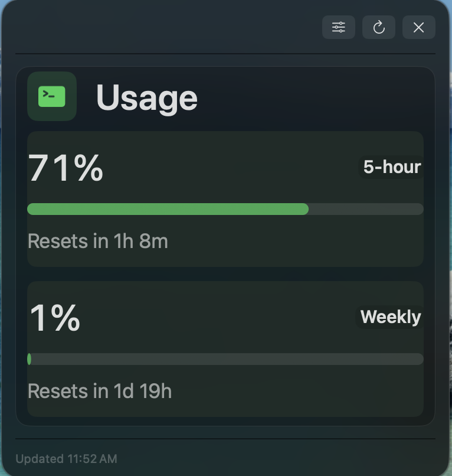

# AI Usage Monitor

A native macOS desktop widget for local AI usage monitoring. It shows enabled subscription or API usage sections for supported providers such as Codex, Claude Code, OpenAI API, Anthropic API, Gemini API, DeepSeek API, and GLM API.



## Install

Download the latest `AI.Usage.Monitor.zip` from:

```text
https://github.com/mmTheBest/ai-usage-monitor/releases/latest
```

Unzip it, move `AI Usage Monitor.app` to `Applications`, then open it.

To run from source:

- macOS 14 or newer
- Xcode Command Line Tools
- Swift Package Manager

```bash
git clone https://github.com/mmTheBest/ai-usage-monitor.git
cd ai-usage-monitor
./Scripts/start-analytics-widget.command
```

To build a local app bundle:

```bash
./Scripts/build-release-app.command
```

The app bundle is written to:

```text
dist/AI Usage Monitor.app
```
